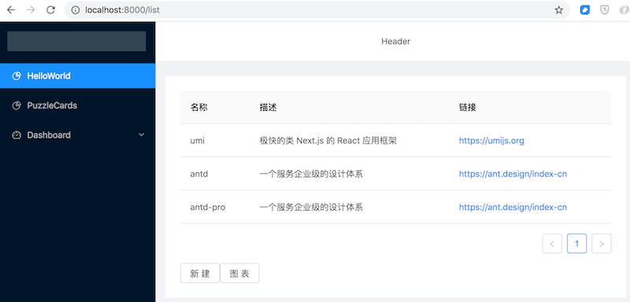

# Ant Design Course Study

Learn Ant Design from [Ant Design 实战教程（beta 版）](https://www.yuque.com/ant-design/course)

## Note

antd 中很多组件使用了 prop 为 component 的用法：

    <SubMenu
      title={<Icon type='dashboard'/>Dashboard}>
      <Menu.Item>分析页</Menu.Item>
      <Menu.Item>监控页</Menu.Item>
      <Menu.Item>工作台</Menu.Item>
    </SubMenu>

    <Card.Meta
      avatar={}
      title="Alipay"
      description="在中台产品的研发过程中，会出现不同的设计规范和实现方式，但其中往往存在很多类似的页面和组件，这些类似的组件会被抽离成一套标准规范。"/>

用到了 render prop 模式 (Table 组件)：

    class List extends React.Component {
      columns = [
        {
          title: '名称',
          dataIndex: 'name'
        },
        {
          title: '描述',
          dataIndex: 'desc'
        },
        {
          title: '链接',
          dataIndex: 'url',
          render: value => <a href={value}>{value}</a>
        }
      ]

在 Layout 中使用了 props.children：

    <Layout>
      <Sider>sider</Sider>
      <Layout>
        <Header>header</Header>
        <Content>{ this.props.children }</Content>
        <Footer>footer</Footer>
      </Layout>
    </Layout>

umi 集成了 mock 和 proxy 功能。

dva 定义 model 后不用显式调用 `app.model(myModel)`，会自动被使用。

自动启动了 css modules。

> CSS modules 不是一个可以安装的 npm 包，也不是 w3c 中的某个标准，只是一项流行的社区规范（an opinionated proposal）。webpack browserify 等打包工具（module bundler）的能力让工具生成局部 CSS 成为可能，CSS modules 规范也应运而生。

上传与下载一小节的总结很不错。

理解了这个课程后再看 Ant Design Pro 的文档就很好理解了。
